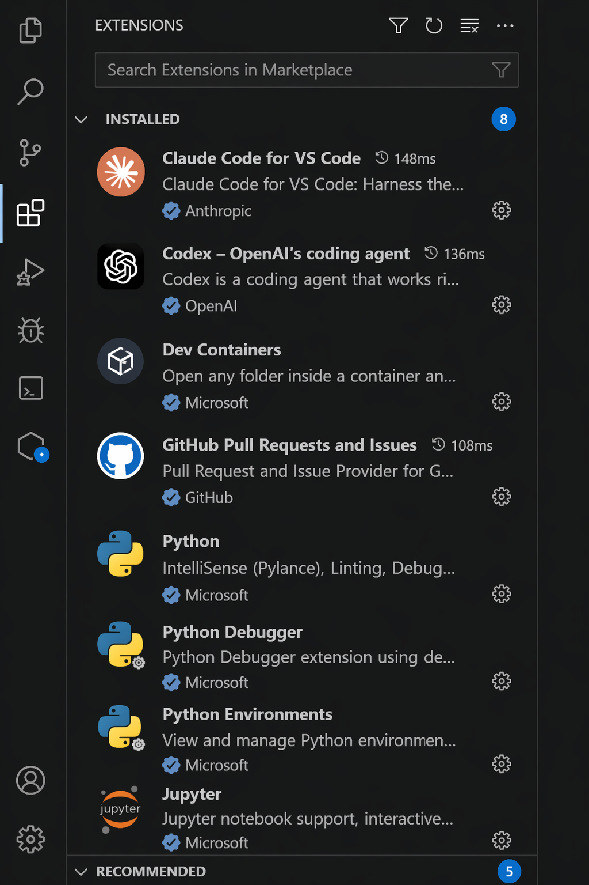

# Portfolio Project — King Joshua Marcos

---

## Chosen Topic

Cold Outreach Pipeline for B2B SaaS

I chose this topic because it directly focuses on how companies generate pipeline through outbound systems.

It also aligns with my experience building ModlyAI, where understanding how to reach and convert potential customers is critical.

Through this project, I analyzed how top experts approach:
- targeting the right prospects
- crafting effective messages
- executing multi-touch outreach
- and building repeatable outbound systems

The goal was to go beyond individual tactics and understand how to build a complete outbound pipeline that drives consistent results.

---

## Research Summary

### What I Collected

For each expert, I collected and analyzed:

- LinkedIn posts (to understand real-time thinking and tactics)
- YouTube content (for deeper frameworks and explanations, where available)
- Patterns across all sources (to identify repeatable systems)

All content was organized into:
- `/research/linkedin-posts/` → structured analysis per expert
- `/research/youtube-transcripts/` → key insights from videos
- `/research/other/` → synthesis (playbook, templates, patterns)

---

### Why I Chose These Experts

The 10 experts were selected based on:

- Real-world experience in outbound, sales, or growth  
- Consistent, high-quality content focused on execution  
- Proven results in B2B SaaS environments  
- Ability to provide actionable insights, not just theory  

They were also chosen to cover different parts of the outbound pipeline:

- **Targeting & Signals** → Morgan J Ingram  
- **Messaging & Offers** → Alex Berman, Nick Abraham  
- **Sales Psychology** → Josh Braun  
- **Execution & Process** → Armand Farrokh  
- **Positioning & Strategy** → Guillaume Moubeche, Chris Orlob  
- **Systems & Scaling** → Kyle Coleman  
- **Content & Distribution** → Devin Reed  
- **Tools & Optimization** → Lavender  

---

### Key Outcome

Instead of treating each expert separately, I focused on identifying common patterns and combining them into a single outbound system.

This resulted in:
- a structured outreach playbook  
- practical messaging templates  
- and a clear framework for building pipeline through outbound  

---

## Outbound Playbook

I synthesized insights from 10 experts into a structured outbound system covering targeting, messaging, execution, and scaling.

See full playbook here:  
/research/other/outreach-playbook.md

---

## Tools Installed
- **Cursor IDE** — My primary development environment for building and maintaining ModlyAI
- **Claude Code** — Used for reasoning, debugging, and structuring logic
- **Codex** — Used for fast autocomplete and generating boilerplate

---

## Steps Completed
1. Installed Cursor IDE (already in daily use)
2. Installed Claude Code extension via Cursor Extensions panel
3. Installed Codex extension via Cursor Extensions panel
4. Created a public GitHub repository
5. Cloned and opened the repository in Cursor
6. Created and structured this README.md file
7. Committed and pushed changes to GitHub

---

## Issues I Ran Into and How I Solved Them

- **Extension Authentication**
  - Claude Code required login via OAuth
  - Resolved by authenticating directly through Cursor

- **Codex Setup**
  - Required API key configuration
  - Resolved by retrieving API key and setting it in environment

- **Git Configuration**
  - Initial push required identity setup
  - Resolved using:
    ```
    git config --global user.name "King Joshua Marcos"
    git config --global user.email "marcos.modly@gmail.com"
    ```

---

## What I Learned

The biggest insight from this project is that outbound is not about a single tactic — it is a system.

Across all experts, the same patterns emerged:

- Strong targeting using real signals (not random lists)
- Clear, short messaging focused on problems, not products
- Low-pressure communication that builds trust
- Consistent follow-up systems (most pipeline comes after the first message)
- Strong offers that give prospects a reason to respond
- Scalable systems that remove reliance on individual effort

I also learned that AI is most effective when used to analyze and connect signals, not just generate content.

This project shifted my perspective from writing better messages to building better systems.

---

## Example Application

To demonstrate how this system works in practice, here’s how I would apply it:

### Target
Furniture / ecommerce companies hiring marketing or growth roles

### Signal
Hiring for “Growth Manager” or “Ecommerce Manager”

### Message

Noticed you're hiring a Growth Manager — usually means you're trying to improve conversion and performance.

We help furniture brands show customers how products actually look in their space, which reduces returns and increases conversion.

Open to exploring?

### Follow-Up

Sent a quick example of how this works:

[demo / explanation]

Thought it might be easier than a long message.

---

## Proof of Work

- **Live Project:** https://modlyai.tech  
- **GitHub:** https://github.com/marcosmodly/modlyai

---

## Screenshots



---

## About Me

I am King Joshua Marcos, based in the Philippines.

I build AI-powered products and automation systems, including ModlyAI; a furniture design SaaS platform I developed independently using tools like Cursor, Next.js, and Vercel.

I don’t just learn tools, I use them daily to build and ship real products.

**Contact:**  
hello@modlyai.tech  
